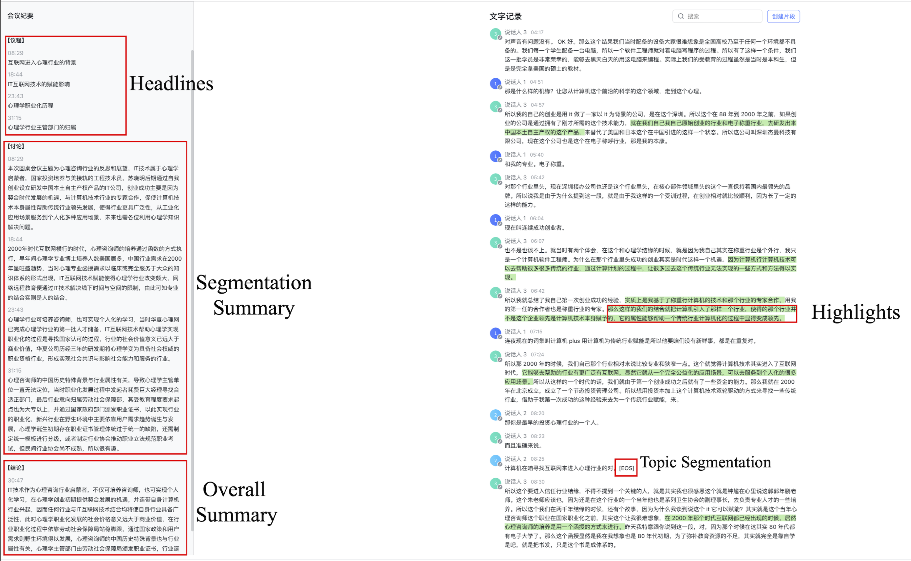

# VCSum: A Versatile Chinese Meeting Summarization Dataset

Han Wu, Mingjie Zhan, Haochen Tan, Zhaohui Hou, Ding Liang and Linqi Song.

Abstract: Compared to news and chat summarization, the development of meeting summarization is 
hugely decelerated by the limited data. To this end, we introduce a versatile Chinese meeting 
summarization dataset, dubbed VCSum, consisting of 239 real-life meetings, with a total 
duration of over 230 hours. We claim our dataset is ***versatile*** because we provide the 
annotations of topic segmentation, headlines, segmentation summaries, overall meeting summaries, 
and salient sentences for each meeting transcript. As such, the dataset can adapt to various 
summarization tasks or methods, including segmentation-based summarization, multi-granularity 
summarization and retrieval-then-generate summarization. Our analysis confirms the effectiveness 
and robustness  of VCSum. We also provide a set of benchmark models regarding different 
downstream summarization tasks on VCSum to facilitate further research.



## Data Structure

The files started with `long_` contain the overall meeting summaries, and the files started with
`short_` contains the segmentation meeting summaries and corresponding headlines.

We put all meeting transcripts in `overall_context.txt` and all highlight annotations in `overall_highlights.txt`. All files share the `id` and `av_num` values.

The `long/short_train/dev/text.txt` files contain the annotations of topic segmentation, headlines, segmentation 
summary and overall meeting summary. The keys in the `dict` are:

- `id` and `av_num`: the unique identifiers of the meeting transcript.
- `eos_index`: the utterance positions of topic segmentation.
- `speaker`: the speaker identifier.
- `context`: the meeting transcript.
- `summary`: the overall meeting summary.
- `discussion`: the segmentation summary.
- `agenda`: the segmentation headline.

The `highlight` files provide the annotations of highlight sentences.

- `id` and `av_num`: the unique identifier of the meeting transcript.
- `highlights`: the 0/1 list of context words. 1 stands for the highlighted word.

## Cite
```
@inproceedings{wu-etal-2023-vcsum,
    title = "{VCSUM}: A Versatile {C}hinese Meeting Summarization Dataset",
    author = "Wu, Han and Zhan, Mingjie and Tan, Haochen and Hou, Zhaohui and Liang, Ding and Song, Linqi",
    booktitle = "Findings of the Association for Computational Linguistics: ACL 2023",
    month = July,
    year = "2023",
    address = "Toronto, Canada",
    publisher = "Association for Computational Linguistics",
    url = "https://aclanthology.org/2023.findings-acl.377",
    pages = "6065--6079"
}
```
